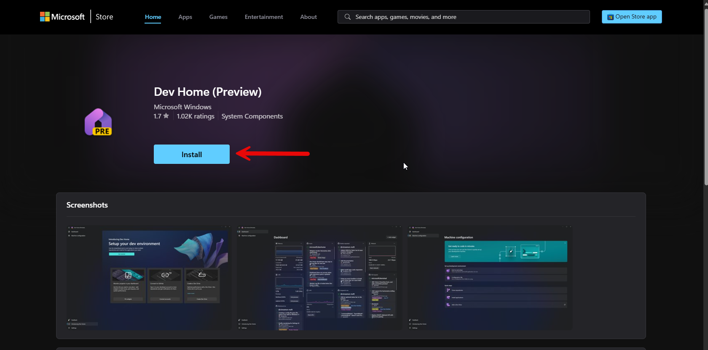
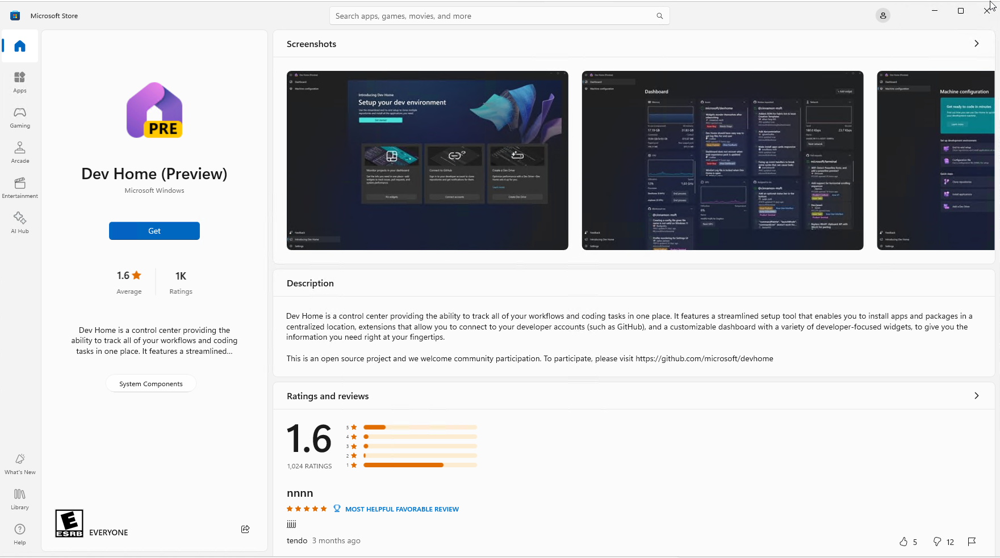

# Enginer Dev Machine Configuration

## Step 1 - Prepare the OS and its configurations for Development

- [Install Microsoft Dev Home](#install-microsoft-dev-home)
- [Configure Windows Dependencies using Microsoft Dev Home](#configure-windows-dependencies-using-microsoft-dev-home)
- [Clone this repo and store it on a Dev Drive](https://learn.microsoft.com/en-us/windows/dev-home/setup#clone-a-repo-and-store-it-on-a-dev-drive)

### Install Microsoft Dev Home

1 - To install Microsoft Dev Home you need to access the [link](https://aka.ms/devhome) and click install to start the installation process using by Microsoft Store.



2 - Click Get to install Microsoft Dev Home



3 - After the installation, find Microsoft Dev Home app and open it


### Configure Windows Dependencies using Microsoft Dev Home

## Step 2 - Update Packages, Installs VS Code Extensions and Updates Dotnet Workloads 

- [Update and Install all dependencies for Windows](#update-and-install-all-dependencies-for-windows)
- [Update and Install all dependencies for Linux](#update-and-install-all-dependencies-for-linux)

### Update and Install all dependencies for Windows
``` powershell
e:\devMachineConfig\srcpowershell\configureDevMachine.ps1
```

### Update and Install all dependencies for Linux
``` bash
cd ../../mnt/e/devMachineConfig/src/bash && \
sudo apt-get update && \
sudo apt-get install -y dos2unix && \
sudo dos2unix *.sh && \
sudo ./updateDependencies.sh
```
